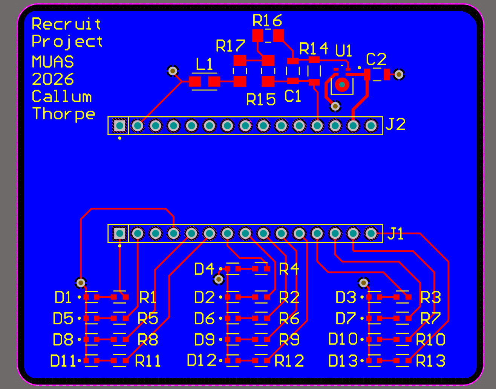
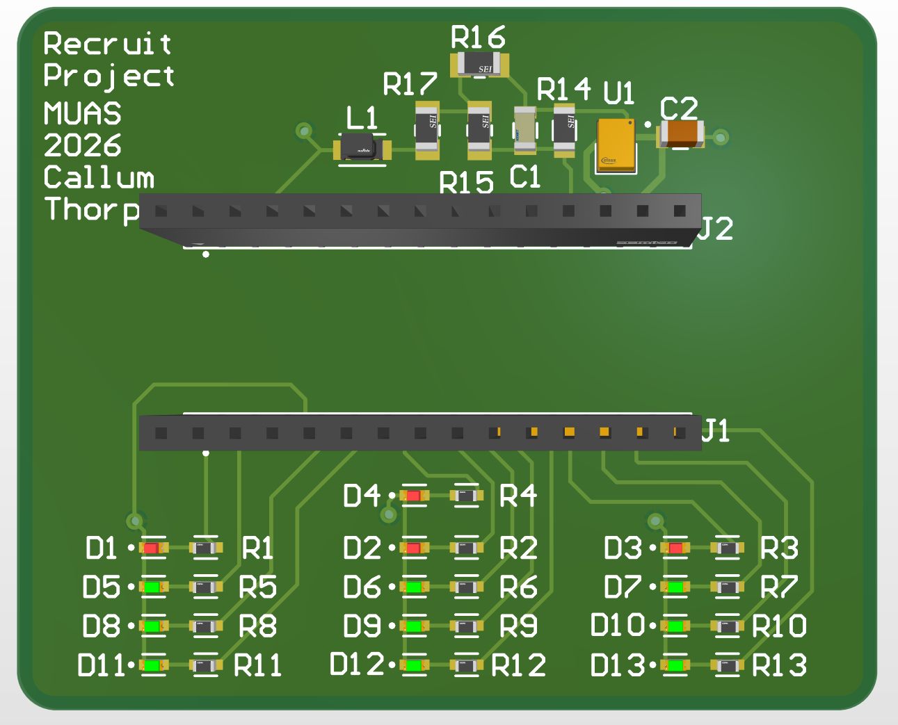

# MUAS-Recruit-Project-2026
_Callum T_

Designed a simple PCB board that uses an analog MEMS microphone connected via a passive bridge-T zöbel 4kHzl high-boost filter to an STM32L432KC microcontroller. 

The MCU then performs a FFT spectral analysis on the input audio (with a given sample rate and buffer size) and activates the array of 3*4 LEDs to create a 3-channel (LOW/MID/HIGH) visual equaliser as well as a 13th LED that lights when a certain dB loudness threshold is surpassed (for hearing safety). Submitted are PCB designs/schematics and code. 

Code is just a rough outline/structure (created with Claude…). Proper testing, debugging and tuning the system would be required. The dB meter would also need to be tuned using an off-the-shelf dB meter. 0603 (for LED array) and 1206 (analog passive filter) component footprints were chosen for ‘ease’ of soldering. The STM32L4 MCU should also be more than capable for the task without being expensive overkill. 

Possible design improvements could be: 
1) Smaller components and MCU integration to reduce package size.
2) Alphanumerical display to show dB loudness.
3) Shift-register LED array so that it could have more than 3 channels.

